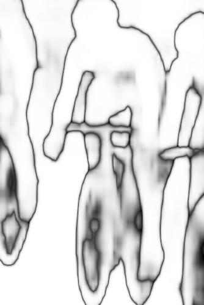
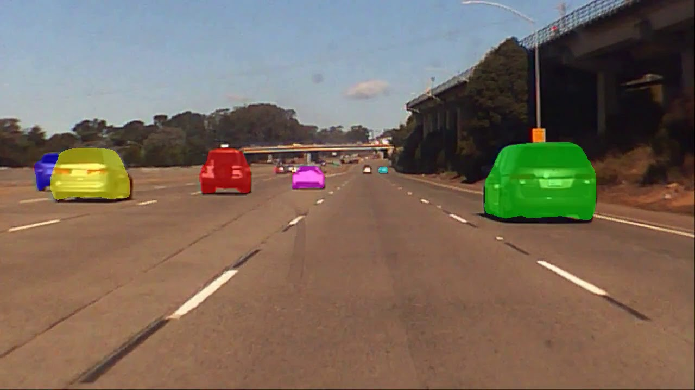
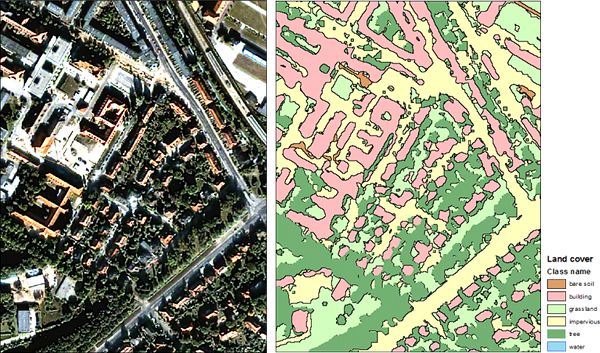
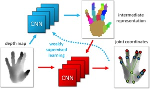

# Capstone Project Proposal: Pixel-level Object Dectection 
## Semantic Segmentation: State of art

Semantic segmentation is the frontier of computer image recognition, which understand an image at pixel level. In segmantic segmentation, we will need to achieve three tasks: 1. recognize the objects; 2. delineate the boundary of each object; 3. Assign each pixel in the image an object class.

Raw Input            |  Probs           |     Segmentation
:---------------:|:--------------:|:---------------:
||

## Bussiness Value 
### 1. Oil and Gas E&P : Automatic Seismic [Fault](https://en.wikipedia.org/wiki/Fault_(geology))/[Horizon](http://subsurfwiki.org/wiki/Horizon) picking and interpretation 
 

Interpreting faults is difficult and tedious, especially in complex, highly faulted formations. Faults can be difficult to pick if they are steeply dipping, or if they are aligned such that they are not easily visible on Inlines or Crosslines. Inaccurate and incomplete interpretations often lead to missed pay, inefficient field development, miscorrelations, drilling hazards – and ultimately dry holes.There are many [state-of-art solutions](https://www.cgg.com/en/What-We-Do/GeoSoftware/Advanced-Seismic-Interpretation/Automated-Fault-Extraction) to speed up the process, these solutions fall in the region of feature engineering and hard to generalize. The current best solution is still on hand-picking or semi-hand-picking by human experts. 

Semantic segmentation is potentially a good AI solution to Falut/Horizon picking and iterpretation as they share many common challenges: 1. Pixel level accuracy: ihe effective pixel size in a subsurface seismic image could be ~ 25 m x 25 m and a borehole could be ~ 20-30 inches, and the pixel level accuracy makes a big difference when drill a well. 2. Pixel level classification: in semantic segmentation, we identify each pixel as car, pedestrain and in seismic fault/horizon interpretation, we identify pixel as layers between Petrel and Oligocence or in a Fault block...) 3. High-stake: I can't elaborate more of how high the stakes are. 

The challenges ahead: 1. Data sets: most of the interpreted data sets are proprietary assets of big oil companies, and those data sets are not regularized for Deep learning training purose.  2. Algorithms: Current best practice for segmantic segmentation. This capstone project can be served as an assessment on the current best practices publically available. 

### 2. Infering knowledge from imagery: In general
Self Driving Car     |  Identify object from satellite imagery |  Human Machine Interaction         
:---------------:|:--------------:|:--------------:
||

## Data Sets to be used:
+ [ADE20K Dataset](http://groups.csail.mit.edu/vision/datasets/ADE20K/)
[(Data QC Randomly selected 40 pic and target and put them togglable in PPT)](https://github.com/HoustonJ2013/Capstone_CV_Galvanize/blob/master/ppts/QC_Dec_12.pptx)
+ [COCO 2017 Stuff Segmentation Challenge](http://cocodataset.org/#stuff-challenge2017) (optional)

## Reference:
+ [The Cityscapes Dataset for Semantic Urban Scene Understanding](https://arxiv.org/pdf/1604.01685.pdf)
+ [Hands Deep in Deep Learning for Hand Pose Estimation](https://arxiv.org/pdf/1502.06807.pdf)
+ [A 2017 Guide to Semantic Segmentation with Deep Learning](http://blog.qure.ai/notes/semantic-segmentation-deep-learning-review)
