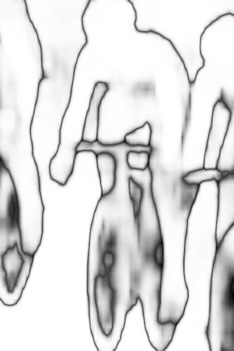

# Capstone Project: Pixel-level Object Dectection 
## Semantic Segmentation: State of art

Semantic segmentation is the frontier of computer image recognition, which understand an image at pixel level. In segmantic segmentation, we will need to achieve three tasks: 1. recognize the objects; 2. delineate the boundary of each object; 3. Assign each pixel in the image an object class.

Raw Input            |  Probs           |     Segmentation
:---------------:|:--------------:|:---------------:
||

## Bussiness Value
### 1. Vision based self driving car
 
### 2. Oil and Gas E&P : Seismic Automatic [Fault](https://en.wikipedia.org/wiki/Fault_(geology))/[Horizon](http://subsurfwiki.org/wiki/Horizon) picking and interpretation 
 

Interpreting faults is difficult and tedious, especially in complex, highly faulted formations. Faults can be difficult to pick if they are steeply dipping, or if they are aligned such that they are not easily visible on Inlines or Crosslines. Inaccurate and incomplete interpretations often lead to missed pay, inefficient field development, miscorrelations, drilling hazards – and ultimately dry holes.There are many 
[state-of-art solutions](https://www.cgg.com/en/What-We-Do/GeoSoftware/Advanced-Seismic-Interpretation/Automated-Fault-Extraction) 
to speed up the process, these solutions fall in the region of feature engineering and hard to generalize. The current best solution is still on hand-picking or modification by human experts. 

Semantic segmentation is potentially a good AI solution to Falut/Horizon picking and iterpretation as they share many common challenges: 1. Pixel level accuracy. 2. Pixel level classification (car, pedestrain, blocks vs Petrel, Oligocence, Fault block...) 3. High-stake. 

[state-of-art solutions](https://www.cgg.com/en/What-We-Do/GeoSoftware/Advanced-Seismic-Interpretation/Automated-Fault-Extraction)

### 3. Object identification in imagery

## Data Sets to be used:
+ [ADE20K Dataset](http://groups.csail.mit.edu/vision/datasets/ADE20K/)
[(Data QC Randomly selected 40 pic and target and put them togglable in PPT)](https://github.com/HoustonJ2013/Capstone_CV_Galvanize/blob/master/ppts/QC_Dec_12.pptx)
+ [COCO 2017 Stuff Segmentation Challenge](http://cocodataset.org/#stuff-challenge2017) (optional)
